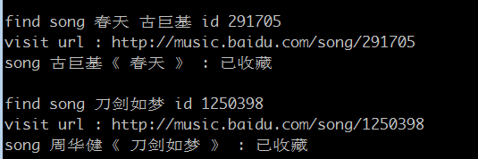

baidu_music
=================

- 将指定音乐 批量导入 百度音乐 收藏，省得私人音乐频道猜来猜去
- 获取指定专辑的音乐信息
- 批量下载音乐
- 批量生成vlc可用的xspf列表文件，在线播放音乐


用法示例
------------------------

```
#登录并收藏
perl baidu_music.pl -u someusr -p somepasswd -c cookie.txt -m music.txt -t collect

#根据music.txt生成xspf（播放列表）/bat（wget批量下载）/ps1（powershell批量下载）
perl baidu_music.pl -m music.txt -t xspf -o vlc.xspf
perl baidu_music.pl -m music.txt -t bat -o wget.bat
perl baidu_music.pl -m music.txt -t ps1 -o web.ps1

#根据album_url生成xspf
perl baidu_music.pl -a http://music.baidu.com/album/177366 -t xspf -o lzs.xspf
perl baidu_music.pl -a http://music.baidu.com/film/70663646 -t xspf -o lzs.xspf

#根据指定关键字查询音乐
perl baidu_music.pl -q "小楼古风精选 Finale" -t xspf -o finale.xspf
perl baidu_music.pl -q "河图" -i 3 -t xspf -o ht.xspf
```

参数说明：
```
u : 用户名
p : 密码
c : cookie文件
m : 音乐文件
a : 专辑url，例如 http://music.baidu.com/album/177366
o : 目标文件，不指定则直接输出到stdout
t : 目标动作类型，例如 xspf 播放列表，wget 批量下载文件，收藏歌曲
l : 音乐文件音质，0 (最好) ~ 3 (最差)，默认取0
f : 音乐文件格式(flac/mp3)
q : 查询音乐的关键字
i : 查询音乐，取其中第 i 页的结果
```

处理过程
--------

album_url（专辑url） / music （音乐列表）

->  music_id （获取音乐id）

-> music_url （获取音乐下载url）

->  xspf （播放列表）/ bat （调用wget批量下载）/ ps1 （windows下调用powershell批量下载）


动作分解(casperjs)
------------------

### 登录
- someusr 为用户名，somepasswd 为密码
- cookie.txt 为存放该用户cookie的文件名
```
casperjs baidu_login.js someusr somepasswd cookie.txt
```

### 指定歌名(艺人)查询音乐id

music.txt 为音乐列表，一行一首，歌名在前（必填），歌手在后（可不填）

结果写入id.txt，如果不指定id.txt，则输出到stdout

```
casperjs baidu_music_id.js music.txt id.txt
casperjs baidu_music_id.js music.txt
```

### 指定关键字查询多首歌

结果写入id.txt，如果不指定id.txt，则输出到stdout

page : 取第几页（默认是取第1页）

```
casperjs baidu_music_query.js "小楼古风精选 Finale" id.txt
casperjs baidu_music_query.js "小楼古风精选 Finale"
casperjs baidu_music_query.js "小楼古风精选 Finale" --page=2
```

### 获取专辑音乐id
结果写入id_swd3e.txt，如果不指定id_swd3e.txt，则输出到stdout
```
casperjs baidu_music_album.js http://music.baidu.com/album/23319159 id_swd3e.txt
```

### 收藏指定音乐
```
casperjs baidu_music_collect.js cookie.txt id.txt
```



### 获取音乐文件url
level : 音质, 0 (最好) ~ 3 (最差)，默认取0

format :  flac, mp3

```
casperjs baidu_music_url.js id.txt url.txt
casperjs baidu_music_url.js id.txt url.txt --level=1
casperjs baidu_music_url.js id.txt url.txt --level=1 --format=mp3
```

### 生成指定格式的默认文件
```
casperjs baidu_musc_write.js url.txt wget.bat --type=bat
casperjs baidu_musc_write.js url.txt vlc.xspf --type=xspf
casperjs baidu_musc_write.js url.txt win.ps1  --type=ps1
```

安装
----

### 安装 phantomjs

http://phantomjs.org/

windows下需要把 phantomjs 目录加入PATH环境变量

### 安装 casperjs

http://casperjs.org/

windows下需要把 casperjs/batchbin 目录加入PATH环境变量

### 安装 wget

windows 下可用 http://users.ugent.be/~bpuype/wget/

### windows下 安装 powershell

powershell v3


问题
----

目前 artist 匹配较严，如果查"水晶 任贤齐"，取回结果为"水晶 任贤齐/徐怀珏"，是不做收藏的


