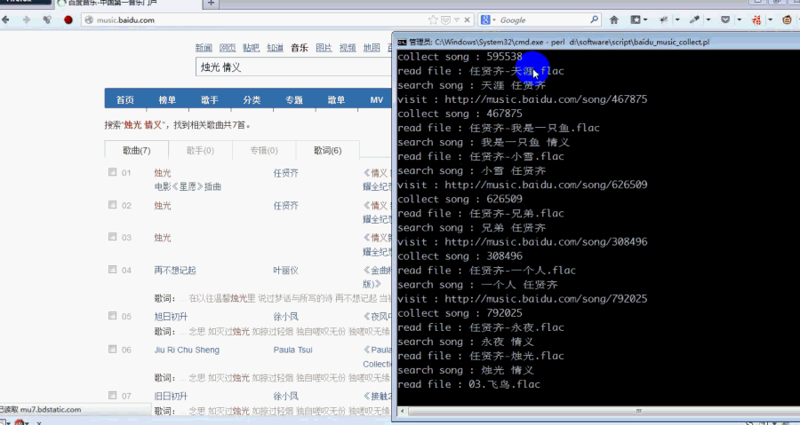

baidu_music_collect
=================
把 本地硬盘保存的音乐文件(flac/mp3)信息 导入 百度音乐 收藏，省得私人音乐频道猜来猜去

* 用法示例

打开firefox，启用mozrepl，登录百度音乐

假设脚本位于 d:\software\script\baidu_music_collect.pl

perl d:\software\script\baidu_music_collect.pl  a.mp3

perl d:\software\script\baidu_music_collect.pl d:\music\周华健

* 问题

有时候明明收藏成功了，页面却提示收藏失败

目前 artist 匹配较严，如果查"任贤齐 水晶"，取回结果为"任贤齐/徐怀珏 水晶"，是不做收藏的

* 安装

**  安装 firefox 及 mozrepl 扩展 

firefox : http://www.mozilla.org/

mozrepl : https://addons.mozilla.org/zh-CN/firefox/addon/mozrepl/?src=search

**  安装 flac

windows版本可采用：http://xiph.org/flac/download.html ，假设安装路径为 d:\software\flac，则将d:\software\flac添加到PATH环境变量下

**  安装 perl

windows版本可选用：http://strawberryperl.com/

**  安装 perl模块

cpan App::cpanminus

cpanm -n -f Data::Dumper

cpanm -n -f Encode::Locale

cpanm -n -f Encode

cpanm -n -f MP3::Info

cpanm -n -f WWW::Mechanize::Firefox

cpanm -n -f Web::Scraper
