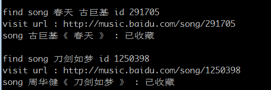

baidu_music_collect
=================
支持指定音乐 
- 批量导入 百度音乐 收藏，省得私人音乐频道猜来猜去
- 获取指定专辑的音乐信息
- 批量下载音乐
- 批量生成vlc可用的xspf列表文件，在线播放音乐

处理过程
--------

album_url（专辑url） / music （音乐列表）

->  music_id （获取音乐id）

-> music_url （获取音乐下载url）

->  xspf （播放列表）/ wget （批量下载）/ powershell （windows下批量下载）


用法示例(casperjs)
------------------

### 登录
- someusr 为用户名，somepasswd 为密码
- cookie.txt 为存放该用户cookie的文件名
```
casperjs baidu_login.js someusr somepasswd cookie.txt
```

### 查询音乐id
- music.txt 为音乐列表，一行一首，歌名在前（必填），歌手在后（可不填）
```
casperjs baidu_music_id.js music.txt id.txt
```

### 获取专辑音乐id
```
casperjs baidu_music_album.js http://music.baidu.com/album/23319159 id_swd3e.txt
```

### 收藏指定音乐
```
casperjs baidu_music_collect.js cookie.txt id.txt
```



### 获取音乐文件url
level : 音质, 0 (最好) ~ 3 (最差)，默认取0

```
casperjs baidu_music_url.js id.txt url.txt
casperjs baidu_music_url.js id.txt url.txt --level=1
```

### 生成指定格式的默认文件
```
casperjs baidu_musc_write.js url.txt wget.bat wget
casperjs baidu_musc_write.js url.txt vlc.xspf xspf
casperjs baidu_musc_write.js url.txt win.ps1  powershell
```

用法示例(baidu_music.pl)
------------------------

```
#登录并收藏
perl baidu_music.pl -u someusr -p somepasswd -c cookie.txt -m music.txt -t collect

#根据music.txt生成xspf/wget/powershell
perl baidu_music.pl -m music.txt -t xspf -o  vlc.xspf
perl baidu_music.pl -m music.txt -t wget -o wget.cmd
perl baidu_music.pl -m music.txt -t powershell -o powershell.ps1

#根据album_url生成xspf
perl baidu_music.pl -a http://music.baidu.com/album/177366 -t xspf -o lzs.xspf
```

参数说明：
```
u : 用户名
p : 密码
c : cookie文件
m : 音乐文件
a : 专辑url，例如 http://music.baidu.com/album/177366
o : 目标文件
t : 目标动作类型，例如 xspf 播放列表，wget 批量下载文件，收藏歌曲
```


用法示例(baidu_music.ps1，用于windows系统)
------------------------------------------
```
.\baidu_music_download.ps1  music.txt music_download.ps1
.\music_download.ps1

.\baidu_album_download.ps1   http://music.baidu.com/album/177366  album_download.ps1
.\album_download.ps1
```

安装
----

### 安装 phantomjs

http://phantomjs.org/

windows下需要把 phantomjs 目录加入PATH环境变量

### 安装 casperjs

http://casperjs.org/

windows下需要把 casperjs/batchbin 目录加入PATH环境变量

### 安装 wget

windows 下可用 http://users.ugent.be/~bpuype/wget/

### windows下 安装 powershell

powershell v3


问题
----

目前 artist 匹配较严，如果查"水晶 任贤齐"，取回结果为"水晶 任贤齐/徐怀珏"，是不做收藏的


